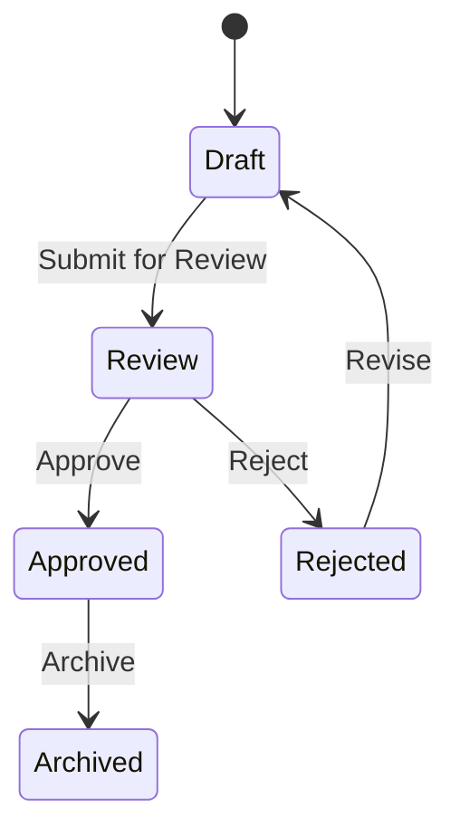

# simple-electronic-cv-workflow
'*Prosty* elektroniczny proces obiegu CV'
ETC: 3 weeks (2025.05.25)

## 🧭 Overview
Brief description of the project and what problem it solves.

### Core features:
- Document creation,
- Doc. approval,
- Doc. signing,
- Doc. archiving
### Project solutions
- Role-based access control
- Notification system
- Integration with third-party services (email)
-  Work in progress... 

## 📐 Architecture
High-level architecture diagram (optional but helpful)

### Diagram

### Description
Explanation of:

Technology stack (e.g., .NET MAUI, Blazor, EF Core, RabbitMQ, etc.)

Layers (e.g., UI, application/service, domain, infrastructure)

Key components (e.g., workflow engine, document manager, user roles)

## 🏗️ Project Structure
Explanation of the folder structure, especially:

Domain/Models

Application/Services

Infrastructure/Persistence

UI/Pages or UI/Components

Plugins/Adapters (for scanners or APIs)

## 🚀 Getting Started
Prerequisites:

.NET SDK version

Database requirements (e.g., PostgreSQL, SQL Server)

Any external services (e.g., SMTP, Auth0, Firebase)

Installation steps:

Clone the repository

Restore packages

Apply migrations

Run the application

## 🔐 Authentication & Authorization
Description of how user authentication and permissions are handled.

Integration with Identity Providers (if any).

## 🧪 Testing
How to run unit, integration, and end-to-end tests.

Frameworks and tools used (e.g., xUnit, Selenium).

## 🔄 Workflow Engine

How document states and transitions are handled.

State machine design (if used).

## 📦 Deployment
Docker support (if applicable)

CI/CD configuration

Deployment to cloud/on-premises

## 📚 API Documentation
How to access and use the API (Swagger/OpenAPI links if available)

## 🔌 Plugins and Extensibility
How to implement custom barcode/RFID scanners or third-party integrations

How to register new workflow steps

## 📈 Monitoring & Logging
Logging framework used (e.g., Serilog)

Health checks and diagnostics

## 🤝 Contributing
Guidelines for contributing, coding standards, branching strategy

## 🪲 Known Issues / Limitations
List of current known limitations or open issues

## 📄 License
The license governing the usage of the project (MIT, GPL, etc.)

## 📬 Contact / Support
How to reach maintainers or get help
